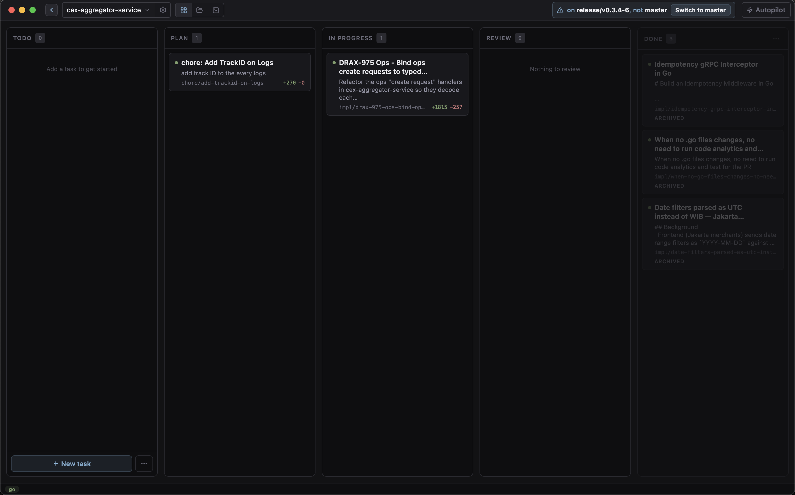
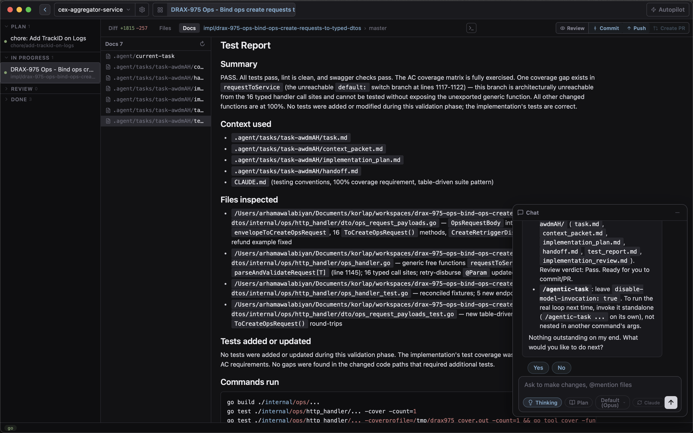
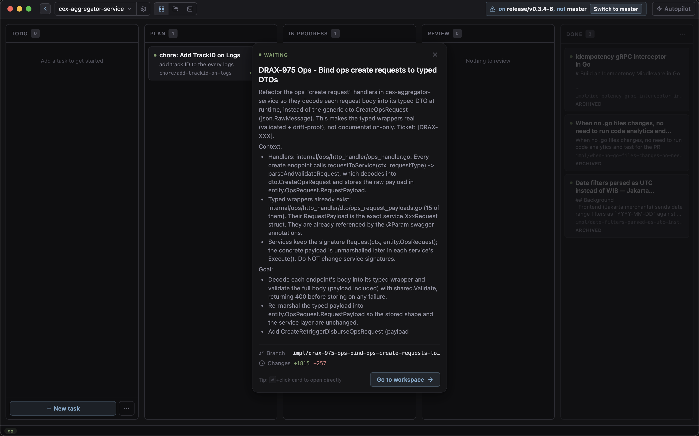
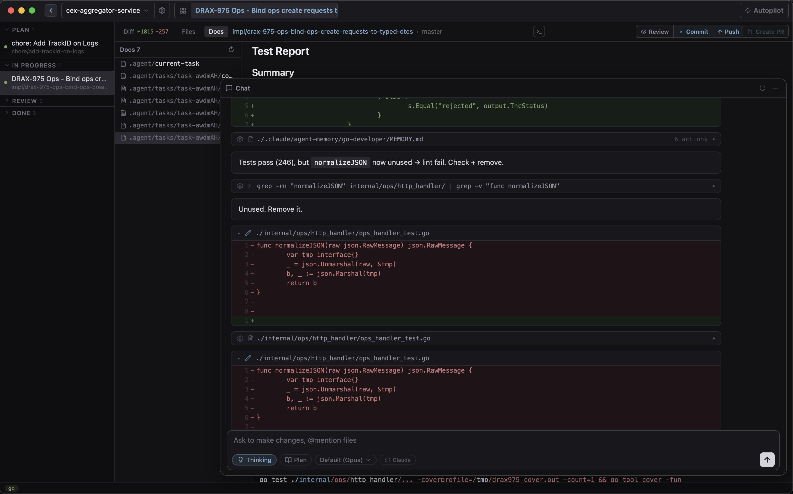
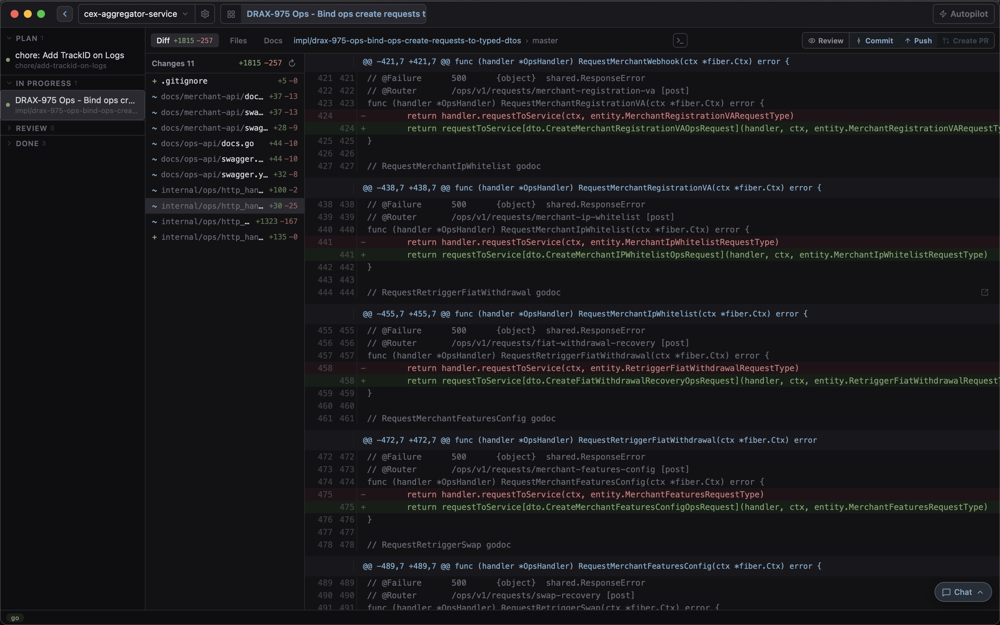

<!-- _class: lead -->

# Korlap

**A feature tour**

 

Run many Claude Code agents in parallel —
each isolated, each watched, all from one board.

---

## A quick note — this is a fork

What you're seeing is **my fork** of Korlap, where I experiment with my own workflow.

For the canonical project, full docs, and releases, **refer to the original repository**.

- **Original:** [ariaghora/korlap](https://github.com/ariaghora/korlap)
- **My fork:** [arham09/korlap](https://github.com/arham09/korlap)

---

## Why I use this — the problem it solves

Running several Claude Code agents at once, the plain tooling fought me at every step.

| Before | With Korlap |
|--------|-------------|
| **Parallel work collides.** One checkout, one branch at a time — stash, switch, stash again. Two tasks can't truly run side by side. | **A `git worktree` per task.** Every agent gets its own working tree + branch. Run many at once; none ever steps on another. |
| **A terminal jungle.** One `claude` per tmux pane, N tabs open, no idea which is mid-task and which is waiting on me. | **One board, every agent.** Switch instantly; status dots show who's running vs. waiting — no terminal-tab roulette. |
| **`git diff` is hard to read.** Raw, unscoped, no highlighting — tough to see what an agent actually changed. | **A real diff view.** Per-workspace, against the merge-base, syntax-highlighted, live — click a hunk to quote it into chat. |

<strong>The point:</strong> isolation + orchestration + visibility — the three things a wall of terminals can't give you.

---

## What's in the box

**Run agents**
- Parallel isolated workspaces
- Kanban-driven lifecycle
- Structured chat
- Diff viewer
- Terminal · Files · Editor

**Automate & integrate**
- LSP for agents
- Branch sync 
- `gh` profiles per repo
- Isolated workspaces

---

## Parallel isolated workspaces

**Every agent gets its own full repo copy** — a `git worktree` on its own branch.

- Agents never collide: separate working tree, branch, diff, and chat history.
- Each runs an isolated `claude` subprocess with its own session.
- Confined to their worktree — they can't touch other workspaces or the main repo.
- Switching between them is instant; each stays alive in the background.

<strong>How:</strong> create a task → Korlap spins up the worktree, branch, and agent automatically.

---

<!-- _class: shot -->

## The sidebar — many agents, each its own workspace

---

## A kanban that drives the agents

The board **is** the lifecycle. Dragging a card advances the agent through:

- **Todo** → defined, no agent yet.
- **Plan** → the agent designs the change (plan mode, optional `plan`).
- **In Progress** → full-permission implementation.
- **Review** → a PR is open; keep iterating.
- **Done** → merged; worktree kept for audit.

<strong>Status dots:</strong> pulsing amber = agent running · olive = waiting on you.

---

<!-- _class: shot -->

## The board — cards flow Todo → Done

---

## Structured chat

Agent output is **parsed, not dumped** — a rich message list, not a raw log.

- From `stream-json`: tool calls, thinking, and results stay distinct.
- Queue messages while the agent is busy.
- Paste **images**, mention **`@file`** paths, run **slash commands**.
- Per-message token counts; full history persisted per workspace.

<strong>Where:</strong> the Chat tab in any workspace.

---

<!-- _class: shot -->

## Structured chat — tool calls, results, tokens

---

## Diff viewer

See exactly what each agent changed — **against the merge-base**, syntax-highlighted.

- Unified diff scoped to the workspace's branch.
- Click a hunk header to **quote it back into chat** as context.
- Updates live as the agent edits.

<strong>Where:</strong> the Diff tab. ⌘R runs an AI Review of the same diff.

---

<!-- _class: shot -->

## Diff against the merge-base, syntax-highlighted

---

## Terminal, Files & Editor

Everything you'd reach for, inside the workspace — no context-switch to another app.

### Terminal
Raw `zsh` PTY tabs, one or many, rooted in the worktree directory. Full native terminal via xterm.js.

### Files & Editor
Browse the worktree as a tree; open and edit any file in a CodeMirror 6 editor with multi-language highlighting.

<strong>Tip:</strong> the agent owns the worktree — edit by hand sparingly.

---

## LSP — agents that navigate code

A per-repo **language-server pool**, exposed to the agent over MCP.

- Built-in defaults for Rust, TypeScript, Svelte, Go, and more — plus custom servers.
- The agent can **hover, go-to-definition, find-references, rename, and read diagnostics** across the whole worktree.
- Far cheaper and more precise than grepping for symbols.

<strong>Where:</strong> configure & monitor servers in ⌘, → LSP.

---

## Branch sync

Keep long-running branches current without leaving the app.

- The header shows **how many commits you're behind** the base branch.
- One click merges the base in (`git merge origin/<base>` inside the worktree).

<strong>Trigger:</strong> ⌘U — Update branch from base.

---

## Tailor each task & each repo

### Per task
- Plan-mode & Thinking toggles
- **Model override** (Sonnet / Opus / Haiku)
- `@file` mentions & pasted images
- "Add and Start" to spawn instantly

### Per repo ⌘,
- `system_prompt`, default model
- `default_start_phase`, `default_plan`
- `openspec_enabled`,

---

<!-- _class: lead -->

# You orchestrate. Agents execute.
